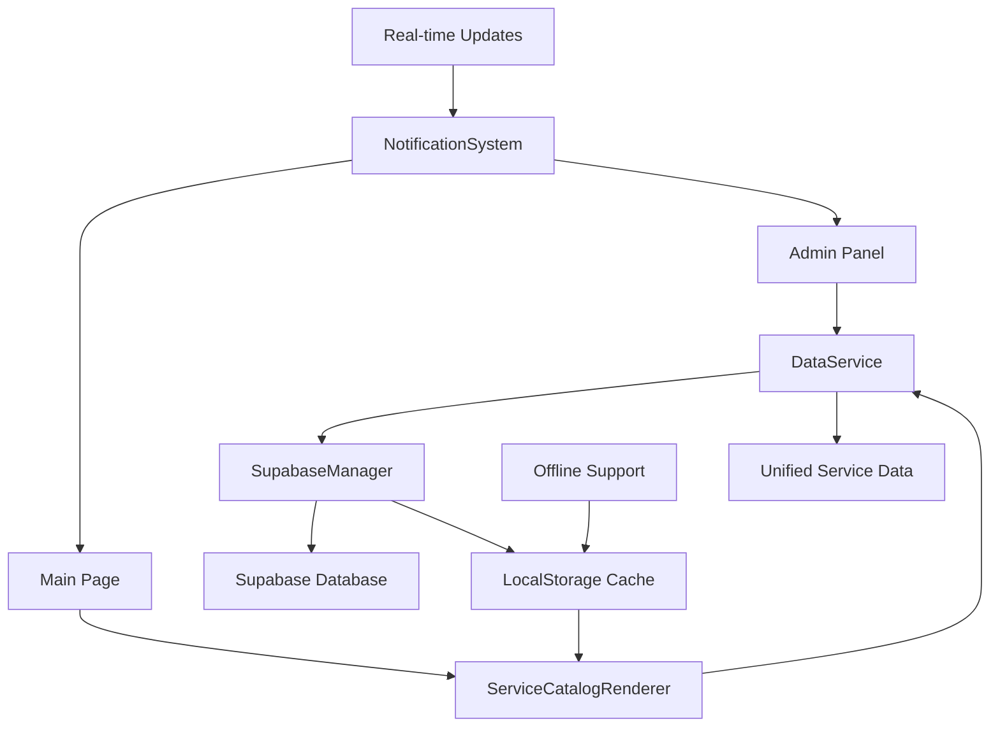

# Design Document

## Overview

This design addresses the critical synchronization gap between the admin panel service management and the main page service catalog. Currently, the main page displays hardcoded services in HTML while the admin panel manages services through localStorage/Supabase, creating a disconnect where new services don't appear in the customer-facing catalog.

The solution involves creating a unified service management system that dynamically loads services from the centralized data source, replacing the hardcoded HTML approach with a dynamic service rendering system.

## Architecture

### Current State Analysis

**Main Page (index.html):**
- Services are hardcoded in HTML within the `#catalogo` section
- Uses static service cards with fixed data
- No connection to admin-managed services
- Relies on `script.js` for basic functionality

**Admin Panel (admin.html):**
- Manages services through DataService and SupabaseManager
- Stores services in Supabase with localStorage fallback
- Has comprehensive CRUD operations for services
- Services are properly validated and cached

**Data Flow:**
- Admin creates/updates services → DataService → Supabase/localStorage
- Main page displays → Static HTML (disconnected)

### Target Architecture



## Components and Interfaces

### 1. ServiceCatalogRenderer

**Purpose:** Dynamically render services in the main page catalog
**Location:** New component in `service-catalog-renderer.js`

```javascript
class ServiceCatalogRenderer {
    constructor(dataService, container) {
        this.dataService = dataService;
        this.container = container;
        this.currentServices = [];
        this.isLoading = false;
    }
    
    async loadAndRenderServices(filters = {}) {
        // Load services from DataService
        // Render service cards dynamically
        // Handle loading states and errors
    }
    
    renderServiceCard(service) {
        // Create service card HTML
        // Include all interactive elements (sliders, buttons)
        // Maintain existing styling and functionality
    }
    
    handleServiceInteraction(serviceId, action) {
        // Handle add to cart, quantity changes, etc.
        // Integrate with existing simulator functionality
    }
    
    updateServiceDisplay(services) {
        // Update the catalog display
        // Handle empty states
        // Maintain scroll position and user interactions
    }
}
```

### 2. ServiceSyncManager

**Purpose:** Handle real-time synchronization between admin and main page
**Location:** Extension of existing `sync-manager.js`

```javascript
class ServiceSyncManager extends SyncManager {
    constructor(supabaseManager, dataService) {
        super(supabaseManager, dataService);
        this.catalogRenderers = [];
    }
    
    registerCatalogRenderer(renderer) {
        // Register catalog renderers for updates
    }
    
    onServiceChange(changeType, serviceData) {
        // Notify all registered renderers
        // Handle create, update, delete operations
        // Trigger re-rendering when needed
    }
    
    setupRealtimeSubscription() {
        // Subscribe to service changes in Supabase
        // Handle real-time updates across sessions
    }
}
```

### 3. ServiceMigrationUtility

**Purpose:** Migrate existing hardcoded services to the data source
**Location:** New utility in `service-migration.js`

```javascript
class ServiceMigrationUtility {
    constructor(dataService) {
        this.dataService = dataService;
    }
    
    async migrateHardcodedServices() {
        // Extract hardcoded services from HTML
        // Check if they already exist in data source
        // Create missing services in database
        // Mark migration as complete
    }
    
    extractServicesFromHTML() {
        // Parse existing service cards
        // Extract service data (name, price, description, etc.)
        // Return structured service objects
    }
    
    async ensureServiceExists(serviceData) {
        // Check if service already exists
        // Create if missing
        // Update if data differs
    }
}
```

## Data Models

### Service Model (Enhanced)

```javascript
{
    id: number,
    name: string,
    description: string,
    price_per_person: number,
    icon: string,
    category: string, // 'buffet', 'doces', 'decoracao', etc.
    active: boolean,
    display_order: number,
    min_quantity: number,
    max_quantity: number,
    unit_type: string, // 'person', 'item', 'hour'
    image_url: string,
    created_at: timestamp,
    updated_at: timestamp,
    
    // Catalog-specific fields
    featured: boolean,
    popular: boolean,
    seasonal: boolean,
    availability_status: string // 'available', 'limited', 'unavailable'
}
```

### Service Display Configuration

```javascript
{
    id: number,
    service_id: number,
    display_type: string, // 'card', 'list', 'featured'
    show_in_catalog: boolean,
    show_in_simulator: boolean,
    custom_styling: object,
    promotional_text: string,
    badge_text: string,
    sort_priority: number
}
```

## Error Handling

### Connection Failures
- **Scenario:** Supabase connection fails during service loading
- **Handling:** 
  - Fall back to localStorage cache
  - Display warning message about offline mode
  - Queue any user interactions for later sync
  - Retry connection periodically

### Data Inconsistencies
- **Scenario:** Services exist in admin but not in main page cache
- **Handling:**
  - Implement cache invalidation strategy
  - Force refresh from authoritative source
  - Show loading state during refresh
  - Log inconsistencies for debugging

### Migration Conflicts
- **Scenario:** Hardcoded services conflict with existing database services
- **Handling:**
  - Use conflict resolution strategy from ConflictResolver
  - Prefer database version over hardcoded
  - Log conflicts for admin review
  - Provide manual resolution interface

### Real-time Update Failures
- **Scenario:** Real-time updates fail to propagate
- **Handling:**
  - Implement polling fallback
  - Show "refresh recommended" notification
  - Allow manual refresh trigger
  - Maintain update queue for retry

## Testing Strategy

### Unit Tests
- ServiceCatalogRenderer component methods
- Service data validation and sanitization
- Cache management and invalidation
- Migration utility functions

### Integration Tests
- End-to-end service creation to display flow
- Offline/online mode transitions
- Real-time update propagation
- Cross-browser compatibility

### User Acceptance Tests
- Admin creates service → appears in catalog
- Service updates reflect immediately
- Offline functionality works correctly
- Performance with large service catalogs

### Performance Tests
- Service loading time benchmarks
- Memory usage with large datasets
- Network request optimization
- Cache effectiveness measurement

## Implementation Phases

### Phase 1: Core Integration
- Create ServiceCatalogRenderer
- Replace hardcoded services with dynamic loading
- Implement basic error handling and fallbacks
- Ensure backward compatibility

### Phase 2: Real-time Synchronization
- Extend SyncManager for service-specific updates
- Implement real-time update notifications
- Add cross-session synchronization
- Handle concurrent modifications

### Phase 3: Migration and Cleanup
- Create ServiceMigrationUtility
- Migrate existing hardcoded services
- Remove hardcoded HTML
- Clean up unused code

### Phase 4: Enhanced Features
- Add service categorization and filtering
- Implement service popularity tracking
- Add promotional features (badges, featured services)
- Optimize performance and caching

### Phase 5: Monitoring and Analytics
- Add service usage analytics
- Implement performance monitoring
- Create admin dashboard for service metrics
- Add automated health checks

## Security Considerations

### Data Validation
- Validate all service data before rendering
- Sanitize HTML content to prevent XSS
- Implement rate limiting for service updates
- Validate user permissions for admin operations

### Access Control
- Ensure only authenticated admins can modify services
- Implement role-based access for different service operations
- Log all service modifications for audit trail
- Secure API endpoints with proper authentication

### Data Integrity
- Implement data consistency checks
- Use database transactions for critical operations
- Validate data relationships and constraints
- Implement backup and recovery procedures

## Performance Optimization

### Caching Strategy
- Implement multi-level caching (memory, localStorage, CDN)
- Use cache invalidation based on service updates
- Implement cache warming for frequently accessed services
- Monitor cache hit rates and optimize accordingly

### Loading Optimization
- Implement lazy loading for service images
- Use pagination for large service catalogs
- Optimize database queries with proper indexing
- Implement service preloading based on user behavior

### Network Optimization
- Minimize API calls through intelligent batching
- Implement request deduplication
- Use compression for large service datasets
- Implement offline-first architecture with sync

## Monitoring and Observability

### Metrics to Track
- Service loading performance
- Cache hit/miss rates
- Real-time update latency
- Error rates and types
- User interaction patterns

### Logging Strategy
- Log all service CRUD operations
- Track performance metrics
- Monitor error patterns
- Log user interaction events

### Alerting
- Alert on service loading failures
- Monitor cache performance degradation
- Alert on sync failures
- Track unusual error patterns