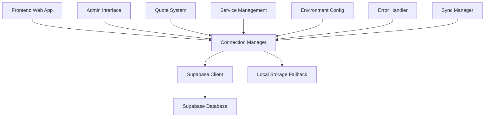
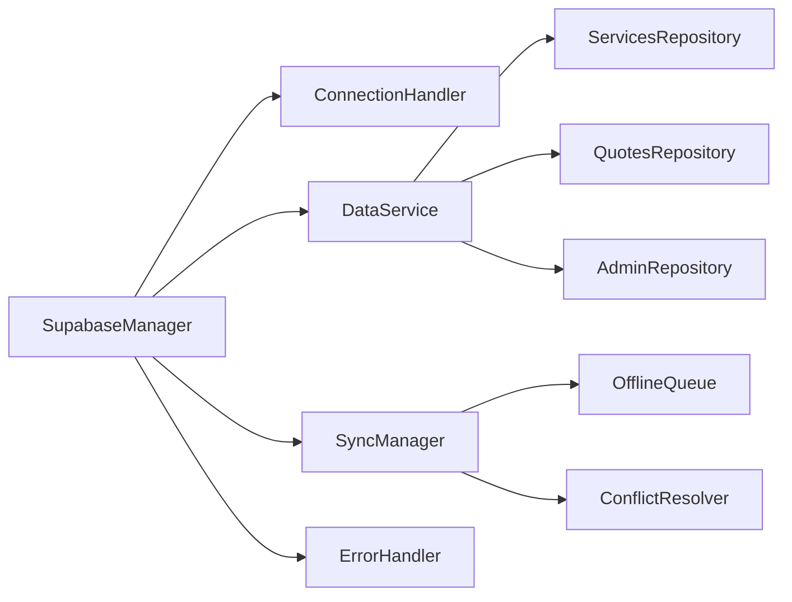

# Design Document

## Overview

Este documento detalha o design para otimizar a integração com Supabase no projeto Buffet Sobral. O sistema atual já possui uma base funcional, mas será aprimorado com melhor arquitetura, tratamento de erros robusto, interface administrativa completa e sistema de sincronização offline/online.

## Architecture

### High-Level Architecture



### Component Architecture



## Components and Interfaces

### 1. Enhanced SupabaseManager

**Responsabilidades:**
- Gerenciar conexão com Supabase
- Coordenar fallback para localStorage
- Controlar sincronização de dados
- Gerenciar configurações de ambiente

**Interface:**
```javascript
class SupabaseManager {
    // Connection Management
    async initialize(config)
    async testConnection()
    getConnectionStatus()
    
    // Data Operations
    async getServices(filters)
    async saveService(serviceData)
    async updateService(id, updates)
    async deleteService(id)
    
    async getQuotes(filters)
    async saveQuote(quoteData)
    async updateQuoteStatus(id, status)
    
    // Sync Operations
    async syncPendingData()
    async forceSyncAll()
    
    // Admin Operations
    async getAdminStats()
    async exportData()
    async importData(data)
}
```

### 2. ConnectionHandler

**Responsabilidades:**
- Detectar status de conexão
- Implementar retry logic
- Gerenciar timeouts
- Notificar mudanças de status

**Interface:**
```javascript
class ConnectionHandler {
    async checkConnection()
    async retryConnection(maxAttempts)
    onConnectionChange(callback)
    getNetworkStatus()
}
```

### 3. DataService

**Responsabilidades:**
- Abstrair operações de dados
- Implementar cache inteligente
- Validar dados antes de salvar
- Gerenciar transações

**Interface:**
```javascript
class DataService {
    async get(table, filters, options)
    async create(table, data, options)
    async update(table, id, data, options)
    async delete(table, id, options)
    async batch(operations)
}
```

### 4. SyncManager

**Responsabilidades:**
- Gerenciar fila de sincronização
- Resolver conflitos de dados
- Implementar sync incremental
- Controlar frequência de sync

**Interface:**
```javascript
class SyncManager {
    async queueOperation(operation)
    async processQueue()
    async resolveConflicts(conflicts)
    setAutoSyncInterval(interval)
}
```

### 5. AdminInterface

**Responsabilidades:**
- Interface para gerenciar serviços
- Dashboard com estatísticas
- Visualização de orçamentos
- Ferramentas de configuração

**Componentes:**
- ServiceManager: CRUD de serviços
- QuoteViewer: Visualização e filtros de orçamentos
- Dashboard: Estatísticas e métricas
- ConfigPanel: Configurações do sistema

### 6. NotificationSystem

**Responsabilidades:**
- Exibir feedback visual
- Notificar status de operações
- Alertas de erro
- Indicadores de carregamento

**Interface:**
```javascript
class NotificationSystem {
    showLoading(message)
    hideLoading()
    showSuccess(message)
    showError(message, actions)
    showInfo(message)
    showConnectionStatus(status)
}
```

## Data Models

### Service Model
```javascript
{
    id: number,
    name: string,
    description: string,
    price_per_person: number,
    category: string,
    icon: string,
    active: boolean,
    created_at: timestamp,
    updated_at: timestamp
}
```

### Quote Model
```javascript
{
    id: number,
    event_type: string,
    guest_count: number,
    services: array,
    total_amount: number,
    customer_info: object,
    status: enum('pending', 'contacted', 'confirmed', 'cancelled'),
    created_at: timestamp,
    updated_at: timestamp
}
```

### Sync Operation Model
```javascript
{
    id: string,
    operation: enum('create', 'update', 'delete'),
    table: string,
    data: object,
    timestamp: timestamp,
    status: enum('pending', 'synced', 'failed'),
    retry_count: number
}
```

## Error Handling

### Error Categories

1. **Connection Errors**
   - Network timeout
   - Supabase unavailable
   - Authentication failure

2. **Data Errors**
   - Validation failure
   - Constraint violation
   - Sync conflicts

3. **Application Errors**
   - Invalid operations
   - Permission denied
   - Resource not found

### Error Handling Strategy

```javascript
class ErrorHandler {
    handleConnectionError(error) {
        // Switch to offline mode
        // Queue operations
        // Notify user
    }
    
    handleDataError(error) {
        // Validate and sanitize
        // Show specific error message
        // Suggest corrections
    }
    
    handleSyncError(error) {
        // Retry with backoff
        // Mark for manual resolution
        // Log for admin review
    }
}
```

### User-Friendly Error Messages

- **Connection Lost**: "Sem conexão com a internet. Seus dados serão salvos localmente e sincronizados quando a conexão for restabelecida."
- **Validation Error**: "Por favor, verifique os campos obrigatórios: [lista de campos]"
- **Sync Conflict**: "Dados foram atualizados por outro usuário. Deseja manter suas alterações ou usar a versão mais recente?"

## Testing Strategy

### Unit Tests
- SupabaseManager methods
- Data validation functions
- Error handling scenarios
- Sync logic

### Integration Tests
- Supabase connection
- Data persistence
- Offline/online transitions
- Admin operations

### End-to-End Tests
- Complete user workflows
- Quote generation process
- Admin service management
- Cross-browser compatibility

### Test Environment Setup
```javascript
// Mock Supabase for testing
const mockSupabase = {
    from: jest.fn().mockReturnThis(),
    select: jest.fn().mockReturnThis(),
    insert: jest.fn().mockReturnThis(),
    update: jest.fn().mockReturnThis(),
    delete: jest.fn().mockReturnThis()
};
```

## Performance Optimizations

### Caching Strategy
- Cache frequently accessed services
- Implement cache invalidation
- Use browser storage efficiently
- Minimize API calls

### Data Loading
- Lazy load non-critical data
- Implement pagination for large datasets
- Use compression for large payloads
- Optimize database queries

### UI Performance
- Show loading states
- Implement optimistic updates
- Use debouncing for search
- Minimize DOM manipulations

## Security Considerations

### Data Protection
- Validate all inputs
- Sanitize user data
- Use parameterized queries
- Implement rate limiting

### Access Control
- Admin authentication
- Role-based permissions
- Secure API endpoints
- Session management

### Environment Security
- Separate dev/prod configs
- Secure credential storage
- HTTPS enforcement
- CORS configuration

## Configuration Management

### Environment Detection
```javascript
const getEnvironment = () => {
    if (window.location.hostname === 'localhost') return 'development';
    if (window.location.hostname.includes('vercel.app')) return 'staging';
    return 'production';
};
```

### Configuration Structure
```javascript
const config = {
    development: {
        supabaseUrl: 'dev-url',
        supabaseKey: 'dev-key',
        debug: true,
        syncInterval: 10000
    },
    production: {
        supabaseUrl: 'prod-url',
        supabaseKey: 'prod-key',
        debug: false,
        syncInterval: 30000
    }
};
```

## Migration Strategy

### Phase 1: Enhanced Connection Management
- Improve existing SupabaseManager
- Add better error handling
- Implement connection status monitoring

### Phase 2: Admin Interface
- Create service management UI
- Add quote viewing capabilities
- Implement dashboard statistics

### Phase 3: Sync System
- Add offline queue
- Implement conflict resolution
- Create sync monitoring

### Phase 4: Performance & Polish
- Optimize loading times
- Add comprehensive testing
- Implement monitoring

## Monitoring and Analytics

### Key Metrics
- Connection success rate
- Sync operation success rate
- Error frequency by type
- User engagement metrics

### Logging Strategy
```javascript
const logger = {
    info: (message, data) => console.log(`[INFO] ${message}`, data),
    warn: (message, data) => console.warn(`[WARN] ${message}`, data),
    error: (message, error) => console.error(`[ERROR] ${message}`, error)
};
```

### Health Checks
- Database connectivity
- API response times
- Error rates
- Data consistency checks